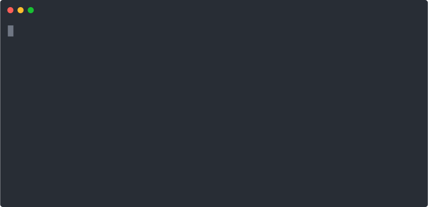

# install-node.vercel.app

Simple one-liner shell script that installs official Node.js binaries



Create `install-node` as an alias!

```bash
alias install-node="curl -sfLS https://install-node.vercel.app | bash -s --"
```
